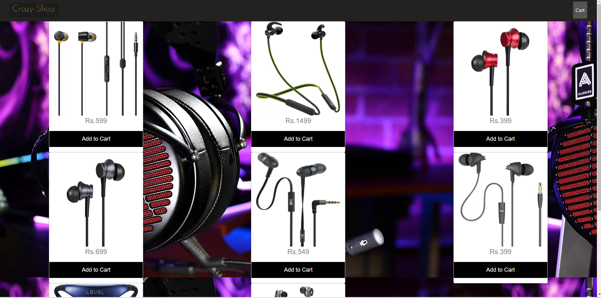
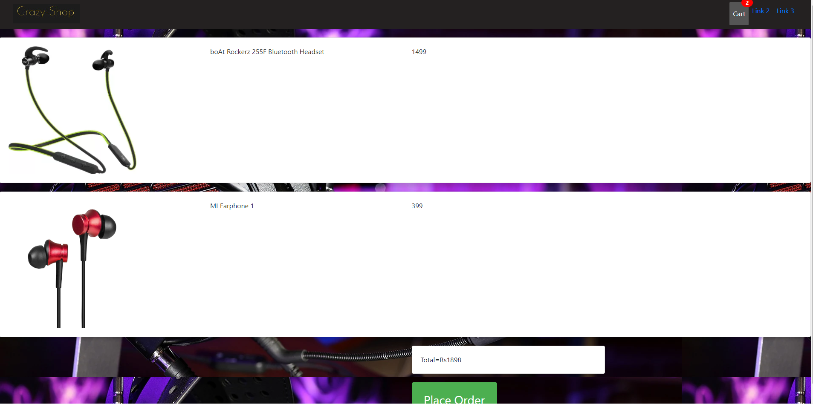
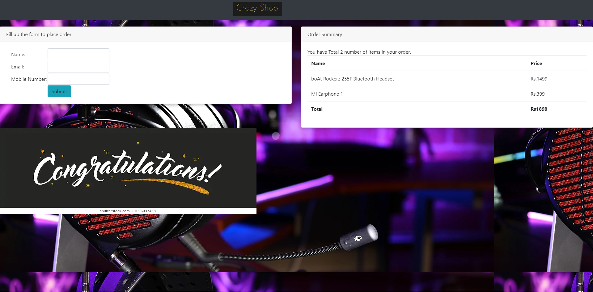

# CrazyShop

This project was generated with [Angular CLI](https://github.com/angular/angular-cli) version 9.1.3.

## Description

An online Shopping Mall which contain following functionalities:
1. Dashboard
2. AddtoCart
3. Placeorder

### 1. Dashboard
This page shows different items along with its price and a addtocart buttun. In nav-var theres the company name and cart link.

### 2. AddtoCart:
This page shows number of items in the cart to place order.

### 3. Placeorder:
This page asks for customer information and order summary.

## Special Implementation

Some of the things i learned:
1. Angular 9
2. Firebase Console
3. How to add firebase features in angular.

## Development server

Run `ng serve` for a dev server. Navigate to `http://localhost:4200/`. The app will automatically reload if you change any of the source files.

## Code scaffolding

Run `ng generate component component-name` to generate a new component. You can also use `ng generate directive|pipe|service|class|guard|interface|enum|module`.

## Build

Run `ng build` to build the project. The build artifacts will be stored in the `dist/` directory. Use the `--prod` flag for a production build.

## Running unit tests

Run `ng test` to execute the unit tests via [Karma](https://karma-runner.github.io).

## Running end-to-end tests

Run `ng e2e` to execute the end-to-end tests via [Protractor](http://www.protractortest.org/).

## Further help

To get more help on the Angular CLI use `ng help` or go check out the [Angular CLI README](https://github.com/angular/angular-cli/blob/master/README.md).
